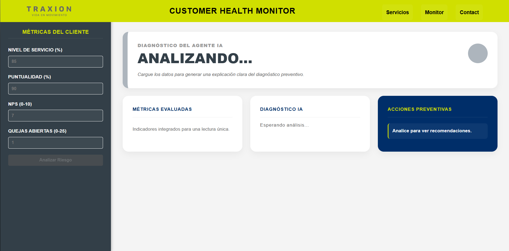
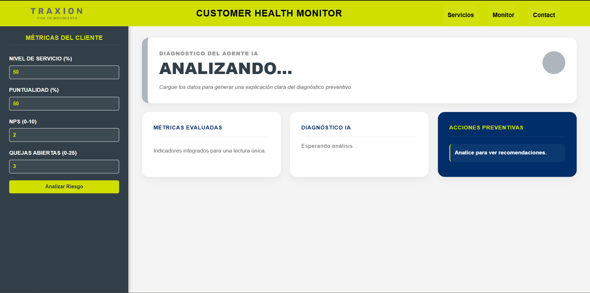
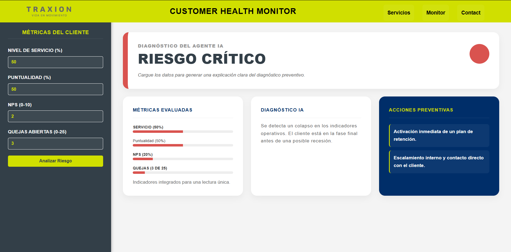
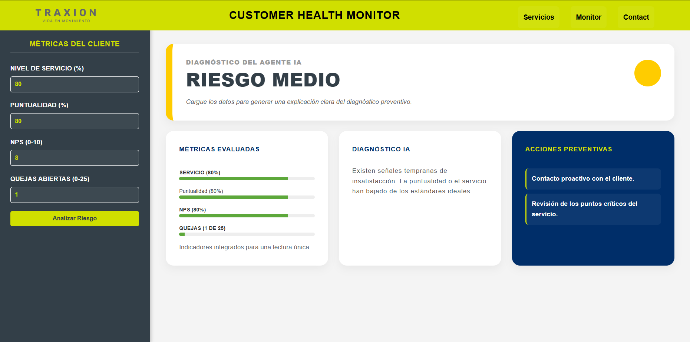
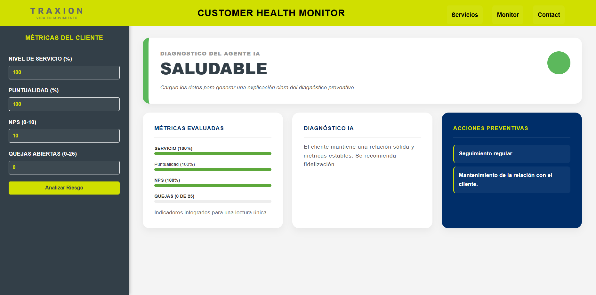

# ⛨ Customer Health Monitor - Proyecto desarrollado para el Hackatón - TechChallenge 2025

>  👨🏻‍💻👩🏻‍💻 Proyecto desarrollado por: Santos Morfin Myriam Korina & Zavaleta Ruíz José Ángel.
---
## 🔴 Objetivo del proyecto
Este proyecto tiene como objetivo resolver la problemática del Eje 2 - Detección temprana de clientes en riesgo (Customer Health) 
del hackatón Bécalos Fundación Traxión TechChallenge 2025, 
mediante una página web creada con las tecnologías HTML, CSS y JavaScript, aplicando los conocimientos vistos en los módulos del curso Course Frontend, y desplegada en GitHub Pages.

---
## </> Tecnologías Utilizadas
* **HTML5:** Estructura semántica del panel de control.
* **CSS3:** Diseño responsivo con identidad visual corporativa.
* **JavaScript (Vanilla):** Lógica simulada del motor de decisión del Agente de IA mediante la implementación de JavaScript.

---
## 🌐 Publicación

Nuestro proyecto está publicado en GitHub Pages y pueden verlo aquí:

👉 **URL del Proyecto:**  
https://ettijoseangel.github.io/Hackaton_TechChallenge2025/

👉 **Repositorio en GitHub:**  
https://github.com/ettijoseangel/Hackaton_TechChallenge2025.git

---
## ▶️ Cómo descargar y ejecutar el proyecto.
1. Descarga la carpeta del proyecto.
2. Asegúrate de que los archivos `index.html`, `style.css` y `script.js` estén en la misma ubicación.
3. Abre `index.html` en cualquier navegador web moderno (Chrome, Edge, Firefox).

---
## 🖼️ Screenshots del proyecto

---

